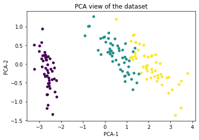

# Data-Visualisation-of-iris-dataset
Using the Tsne and the PCA algorithms for dimension reduction and data visulaization.
The above two algorithms are used extensively for dimension reduction and data visualisation which is a vital step in machine learning and data science.

The PCA algorithm tries to find new directions to plot the original data samples such that the variance among the data points gets maximized  and the directions turn out to the eigen vectors of the original feature space(the proof using Lagrangian multiplier).

Tsne on the other hand tries to plot the higher dimensional data into lower using a similarity concept where first it assigns a 
Gaussian Distribution to all the points and there after based upon the distance value of points from that point it assigns them unscaled similarity scores and using the Kullback leibler cost and graident descent optimization technique it tries to make the two distribution to resemble to each other as much as possible.

Here is the comparison of the result of the two algorithms perfomring the dimension reduction on the irsi dataset and conveting them to 2D::

PCA tries to maximize the variance of the data whereas TSNE tries to create embedding from high dimension to low dimension. Both the algorithms have their own importance but for visualisation purposes TSNE does a better job in most of the cases.